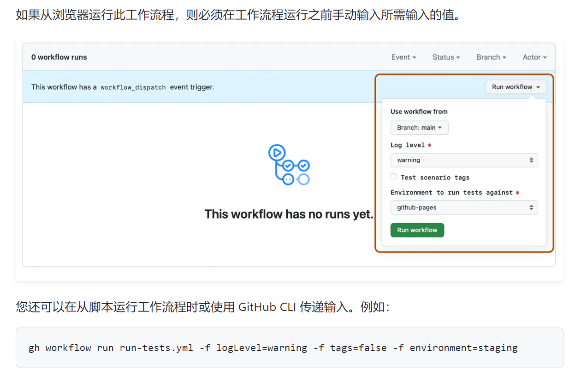

# 触发工作流的事件
## branch_protection_rule
触发原因：存储库中的 _<u>分支保护规则</u>_ 发生更改
- created
- edited
- deleted

&check; `GITHUB_SHA`: 默认分支上的最后一次提交

&check; `GITHUB_REF`: 默认分支
```
on:
  branch_protection_rule:
    types: [created, deleted]
```

## check_run？？
触发原因：发生与<u> _检查运行_ </u>相关的活动。检查运行是检查套件中的一项单独测试。
- created
- rerequested
- completed
- requested_action

&check; `GITHUB_SHA`: 默认分支上的最后一次提交

&check; `GITHUB_REF`: 默认分支
```
on:
  check_run:
    types: [rerequested, completed]
```

## check_suite
触发原因：发生<u> _检查套件_ </u>活动。检查套件是针对特定提交创建的检查运行的集合。检查套件总结了套件中检查运行的状态和结论。
-completed

&check; `GITHUB_SHA`: 默认分支上的最后一次提交

&check; `GITHUB_REF`: 默认分支
```
on:
  check_suite:
    types: [completed]
```

## create
触发原因：存储库中<u> _创建 Git 引用_ </u>（Git 分支或标签）
- 无活动类型

&check; `GITHUB_SHA`: 创建分支或标签上的最后一次提交

&check; `GITHUB_REF`: 已创建分支或标签
```
on:
  create
```

## delete
触发原因：存储库中<u> _删除 Git 引用_ </u>（Git 分支或标签）
- 无活动类型

&check; `GITHUB_SHA`: 默认分支上的最后一次提交

&check; `GITHUB_REF`: 默认分支
```
on:
  delete
```

## deployment
触发原因：存储库中<u> _创建部署_ </u> 
- 无活动类型

&check; `GITHUB_SHA`: 承诺部署

&check; `GITHUB_REF`: 要部署的分支或标签（如果使用提交 SHA 创建则为空）
```
on:
  deployment
```

## deployment_status
触发原因：存储库中<u> _第三方提供部署状态_ </u> 。使用提交 SHA 创建的部署可能没有 Git 引用。
- 无活动类型

&check; `GITHUB_SHA`: 承诺部署

&check; `GITHUB_REF`: 要部署的分支或标签（如果提交则为空）
```
on:
  deployment_status
```

## discussion
触发原因：存储库中的<u> _创建或修改讨论_ </u>。对于与讨论评论相关的活动，请使用事件`discussion_comment`。
- created
- edited
- deleted
- transferred
- pinned
- unpinned
- labeled
- unlabeled
- locked
- unlocked
- category_changed
- answered
- unanswered

&check; `GITHUB_SHA`: 默认分支上的最后一次提交

&check; `GITHUB_REF`: 默认分支
```
on:
  discussion:
    types: [created, edited, answered]
```

## discussion_comment
触发原因：存储库中的<u> _讨论评论被创建或修改_ </u>。对于与讨论相关的活动（而不是讨论评论），请使用事件`discussion`。
- created
- edited
- deleted

&check; `GITHUB_SHA`: 默认分支上的最后一次提交

&check; `GITHUB_REF`: 默认分支
```
on:
  discussion_comment:
    types: [created, deleted]
```

## fork
触发原因：有人<u> _ fork 存储库_ </u>
- 无活动类型

&check; `GITHUB_SHA`: 默认分支上的最后一次提交

&check; `GITHUB_REF`: 默认分支
```
on:
  fork
```

## gollum
触发原因：有人<u> _创建或更新 Wiki 页面_ </u>
- 无活动类型

&check; `GITHUB_SHA`: 默认分支上的最后一次提交

&check; `GITHUB_REF`: 默认分支
```
on:
  gollum
```

## issue_comment
触发原因：<u> _创建、编辑或删除问题或拉取请求评论_ </u>
- created
- edited
- deleted

&check; `GITHUB_SHA`: 默认分支上的最后一次提交

&check; `GITHUB_REF`: 默认分支
```
on:
  issue_comment:
    types: [created, deleted]
```

| 事件`issue_comment`针对问题和拉取请求的评论发生。您可以`github.event.issue.pull_request`在条件中使用该属性，根据触发对象是问题还是拉取请求来采取不同的操作。
```
on: issue_comment

jobs:
  pr_commented:
    # This job only runs for pull request comments
    name: PR comment
    if: ${{ github.event.issue.pull_request }}
    runs-on: ubuntu-latest
    steps:
      - run: |
          echo A comment on PR $NUMBER
        env:
          NUMBER: ${{ github.event.issue.number }}

  issue_commented:
    # This job only runs for issue comments
    name: Issue comment
    if: ${{ !github.event.issue.pull_request }}
    runs-on: ubuntu-latest
    steps:
      - run: |
          echo A comment on issue $NUMBER
        env:
          NUMBER: ${{ github.event.issue.number }}
```
## issues
触发原因：存储库中的<u> _问题被创建或修改_ </u>
- opened
- edited
- deleted
- transferred
- pinned
- unpinned
- closed
- reopened
- assigned
- unassigned
- labeled
- unlabeled
- locked
- unlocked
- milestoned
- demilestoned

&check; `GITHUB_SHA`: 默认分支上的最后一次提交

&check; `GITHUB_REF`: 默认分支
```
on:
  issues:
    types: [opened, edited, milestoned]
```

## label
触发原因：存储库中的<u> _创建或修改标签时_ </u>
- created
- edited
- deleted

&check; `GITHUB_SHA`: 默认分支上的最后一次提交

&check; `GITHUB_REF`: 默认分支
```
on:
  label:
    types: [created, deleted]
```

## merge_group
触发原因：<u> _拉取请求添加到合并队列_ </u>
- checks_requested

&check; `GITHUB_SHA`: 合并组的 SHA

&check; `GITHUB_REF`: 合并组的引用
```
on:
  pull_request:
    branches: [ "main" ]
  merge_group:
    types: [checks_requested]
```

## milestone
触发原因：存储库中<u> _创建或修改里程碑_ </u>
- created
- closed
- opened
- edited
- deleted

&check; `GITHUB_SHA`: 默认分支上的最后一次提交

&check; `GITHUB_REF`: 默认分支
```
on:
  milestone:
    types: [opened, deleted]
```

## page_build
触发原因：存储库<u> _启用了 GitHub Pages_ </u>，则当有人<u> _推送_ </u>到作为 GitHub Pages <u> _发布源_ </u>的分支
- 无活动类型

&check; `GITHUB_SHA`: 默认分支上的最后一次提交

&check; `GITHUB_REF`: 不适用
```
on:
  page_build
```

## project
触发原因：<u> _创建或修改项目（经典）_ </u>
- created
- closed
- reopened
- edited
- deleted

&check; `GITHUB_SHA`: 默认分支上的最后一次提交

&check; `GITHUB_REF`: 默认分支
```
on:
  project:
    types: [created, deleted]
```

## project_card
触发原因：<u> _创建或修改项目（经典）上的卡片_ </u>。对于与项目（经典）或项目（经典）中的列相关的活动，请改用`project`或`project_column`事件。
- created
- moved
- converted to an issue
- edited
- deleted

&check; `GITHUB_SHA`: 默认分支上的最后一次提交

&check; `GITHUB_REF`: 默认分支
```
on:
  project_card:
    types: [created, deleted]
```

## project_column
触发原因：<u> _创建或修改项目（经典）中的列_ </u>。对于与项目（经典）或项目（经典）中的卡片相关的活动，请改用`project`或`project_card`事件。
- created
- updated
- moved
- deleted

&check; `GITHUB_SHA`: 默认分支上的最后一次提交

&check; `GITHUB_REF`: 默认分支
```
on:
  project_column:
    types: [created, deleted]
```

## public
触发原因：<u> _存储库从私有变为公开_ </u>
- 无活动类型

&check; `GITHUB_SHA`: 默认分支上的最后一次提交

&check; `GITHUB_REF`: 默认分支
```
on:
  public
```

## pull_request
触发原因：存储库中的<u> _拉取请求_ </u>发生。例如，如果未指定活动类型，则工作流程将在打开或重新打开拉取请求时或更新拉取请求的头分支时运行。对于与拉取请求审核、拉取请求审核评论或拉取请求评论相关的活动，请改用`pull_request_review`、`pull_request_review_comment`或`issue_comment`事件。
- assigned
- unassigned
- labeled
- unlabeled
- opened
- edited
- closed
- reopened
- synchronize
- converted_to_draft
- locked
- unlocked
- enqueued
- dequeued
- milestoned
- demilestoned
- ready_for_review
- review_requested
- review_request_removed
- auto_merge_enabled
- auto_merge_disabled

&check; `GITHUB_SHA`: GITHUB_REF分支上的最后一次合并提交

&check; `GITHUB_REF`: PR 合并分支refs/pull/PULL_REQUEST_NUMBER/merge
```
on:
  pull_request:
    types: [opened, reopened]
```
| 可以使用事件上下文进一步控制工作流程中的作业何时运行。例如，此工作流程将在请求对拉取请求进行审核时运行，但作业`specific_review_requested`仅在请求审核时运行`octo-team`
```
on:
  pull_request:
    types: [review_requested]
jobs:
  specific_review_requested:
    runs-on: ubuntu-latest
    if: ${{ github.event.requested_team.name == 'octo-team'}}
    steps:
      - run: echo 'A review from octo-team was requested'
```
| pull_request根据拉取请求的头分支或基础分支运行工作流程
```
on:
  pull_request:
    types:
      - opened
jobs:
  run_if:
    if:  startsWith(github.head_ref, 'releases/')
    runs-on: ubuntu-latest
    steps:
      - run: echo "The head of this PR starts with 'releases/'"
```
| pull_request根据拉取请求中更改的文件运行工作流程
```
on:
  pull_request:
    types:
      - opened
    branches:
      - 'releases/**'
    paths:
      - '**.js'
```

| pull_request当拉取请求合并时运行你的工作流程
```
on:
  pull_request:
    types:
      - closed

jobs:
  if_merged:
    if: github.event.pull_request.merged == true
    runs-on: ubuntu-latest
    steps:
    - run: |
        echo The PR was merged
```
| fork 存储库中的工作流程

默认情况下，工作流程不会在 fork 的存储库中运行。您必须在 fork 的存储库的“操作”选项卡中启用 `GitHub Actions`。

除外`GITHUB_TOKEN`，当从 fork 存储库触发工作流程时，不会将`secret`传递给运行器。`GITHUB_TOKEN`在来自 fork 存储库的拉取请求中具有只读权限。 

| fork 存储库的拉取请求事件

对于从复刻仓库到基础仓库的拉取请求，`GitHub` 会将`pull_request`、`issue_comment`、`pull_request_review_comment`、`pull_request_review`和`pull_request_target`事件发送到基础仓库。复刻仓库上不会发生任何拉取请求事件。

当首次贡献者向公共存储库提交拉取请求时，具有写入权限的维护者可能需要批准拉取请求上运行的工作流程。

从 fork 存储库到私有存储库的拉取请求，工作流程仅在启用时运行。

## pull_request_comment (use issue_comment)
要在创建、编辑或删除拉取请求（而不是拉取请求的差异）上的评论时运行工作流程，请使用事件`issue_comment`。对于与拉取请求审核或拉取请求审核评论相关的活动，请使用`pull_request_review`或`pull_request_review_comment`事件。

## pull_request_review
触发原因：<u> _提交、编辑或拒绝拉取请求审核_ </u>
- submitted
- edited
- dismissed

&check; `GITHUB_SHA`: GITHUB_REF分支上的最后一次合并提交

&check; `GITHUB_REF`: PR 合并分支refs/pull/PULL_REQUEST_NUMBER/merge
```
on:
  pull_request_review:
    types: [edited, dismissed]
```
### 当拉取请求被批准时运行工作流程
要在拉取请求获得批准后运行工作流，您可以使用事件`submitted`类型触发工作流`pull_request_review`，然后使用属性检查审核状态`github.event.review.state`。例如，此工作流将在提交拉取请求审核时运行，但`approved`仅当提交的审核是批准审核时，作业才会运行：
```
on:
  pull_request_review:
    types: [submitted]

jobs:
  approved:
    if: github.event.review.state == 'approved'
    runs-on: ubuntu-latest
    steps:
      - run: echo "This PR was approved"
```
|  fork 存储库中的工作流程

默认情况下，工作流程不会在 fork 的存储库中运行。您必须在 fork 的存储库的“操作”选项卡中启用 `GitHub Actions`。

除外`GITHUB_TOKEN`，当从 fork 存储库触发工作流程时，不会将`secret`传递给运行器。`GITHUB_TOKEN`在来自 fork 存储库的拉取请求中具有只读权限。 

|  fork 存储库的拉取请求事件

对于从复刻仓库到基础仓库的拉取请求，`GitHub` 会将`pull_request`、`issue_comment`、`pull_request_review_comment`、`pull_request_review`和`pull_request_target`事件发送到基础仓库。复刻仓库上不会发生任何拉取请求事件。

当首次贡献者向公共存储库提交拉取请求时，具有写入权限的维护者可能需要批准拉取请求上运行的工作流程。

对于从 fork 存储库到私有存储库的拉取请求，工作流程仅在启用时运行

## pull_request_review_comment
触发原因：<u> _拉取请求审核评论被修改_ </u>
- created
- edited
- deleted

&check; `GITHUB_SHA`: GITHUB_REF分支上的最后一次合并提交

&check; `GITHUB_REF`: PR 合并分支refs/pull/PULL_REQUEST_NUMBER/merge
```
on:
  pull_request_review_comment:
    types: [created, deleted]
```
|  fork 存储库中的工作流程

默认情况下，工作流程不会在 fork 的存储库中运行。您必须在 fork 的存储库的“操作”选项卡中启用 `GitHub Actions`。

除外`GITHUB_TOKEN`，当从 fork 存储库触发工作流程时，不会将`secret`传递给运行器。`GITHUB_TOKEN`在来自 fork 存储库的拉取请求中具有只读权限。 

|  fork 存储库的拉取请求事件

对于从复刻仓库到基础仓库的拉取请求，`GitHub` 会将`pull_request`、`issue_comment`、`pull_request_review_comment`、`pull_request_review`和`pull_request_target`事件发送到基础仓库。复刻仓库上不会发生任何拉取请求事件。

当首次贡献者向公共存储库提交拉取请求时，具有写入权限的维护者可能需要批准拉取请求上运行的工作流程。

对于从 fork 存储库到私有存储库的拉取请求，工作流程仅在启用时运行

## pull_request_target
触发原因：存储库中的<u> _拉取请求发生活动_ </u>
- assigned
- unassigned
- labeled
- unlabeled
- opened
- edited
- closed
- reopened
- synchronize
- converted_to_draft
- ready_for_review
- locked
- unlocked
- review_requested
- review_request_removed
- auto_merge_enabled
- auto_merge_disabled

&check; `GITHUB_SHA`: PR 基础分支上的最后一次提交

&check; `GITHUB_REF`: PR 基础分支
```
on:
  pull_request_target:
    types: [assigned, opened, synchronize, reopened]
```
| pull_request_target根据拉取请求的头分支或基础分支运行工作流程

```
on:
  pull_request_target:
    types:
      - opened
jobs:
  run_if:
    if:  startsWith(github.head_ref, 'releases/')
    runs-on: ubuntu-latest
    steps:
      - run: echo "The head of this PR starts with 'releases/'"
```
| pull_request_target根据拉取请求中更改的文件运行工作流程

如果同时使用branches过滤器和paths过滤器，则工作流程仅在两个过滤器都满足时才会运行。例如，以下工作流程仅在名称以.js开头的分支上打开包含对 JavaScript ( ) 文件的更改的拉取请求时才会运行releases/
```
on:
  pull_request_target:
    types:
      - opened
    branches:
      - 'releases/**'
    paths:
      - '**.js'
```
| pull_request_target当拉取请求合并时运行你的工作流程

当拉取请求合并时，拉取请求会自动关闭。若要在拉取请求合并时运行工作流，请使用事件类型以及检查事件值的`pull_request_target` `closed`条件。例如，以下工作流将在拉取请求关闭时运行。只有当拉取请求也合并时，`if_merged`才会运行。
```
on:
  pull_request_target:
    types:
      - closed

jobs:
  if_merged:
    if: github.event.pull_request.merged == true
    runs-on: ubuntu-latest
    steps:
    - run: |
        echo The PR was merged
```
## push
触发原因：<u> _推送提交或标签_ </u>或<u> _从模板创建存储库_ </u>
- 无活动类型

&check; `GITHUB_SHA`: 当您删除分支时，工作流运行中的 SHA（及其相关引用）将恢复为存储库的默认分支。

&check; `GITHUB_REF`: 更新节点
```
on:
  push
```
| 仅当推送到特定分支时才运行工作流程

```
on:
  push:
    branches:
      - 'releases/**'
    paths:
      - '**.js'
```
| 仅在推送特定标签时运行工作流程
```
on:
  push:
    tags:
      - v1.**
```
| 仅当推送影响特定文件时才运行工作流程
```
on:
  push:
    branches:
      - 'releases/**'
    paths:
      - '**.js'
```

## registry_package
触发原因：存储库中的<u> _发生与 GitHub Packages 相关的活动_ </u>
- published
- updated

&check; `GITHUB_SHA`: 已发布包的提交

&check; `GITHUB_REF`: 已发布软件包的分支或标签
```
on:
  registry_package:
    types: [published]
```

## release
触发原因：存储库中的<u> _发生发布活动_ </u>
- published
- unpublished
- created
- edited
- deleted
- prereleased
- released

&check; `GITHUB_SHA`: 标记版本中的最后一次提交

&check; `GITHUB_REF`: 发布的标签引用refs/tags/<tag_name>
```
on:
  release:
    types: [published]
```

## repository_dispatch
触发原因：存储库中的<u> _检查运行_ </u>发生更改
- Custom(自定义)

&check; `GITHUB_SHA`: 默认分支上的最后一次提交

&check; `GITHUB_REF`: 默认分支

| 值event_type限制为100个字符
```
# 通过该参数发送的任何数据都client_payload将在工作流的上下文中可用github.event。例如，如果您在创建存储库调度事件时发送此请求正文：
{
  "event_type": "test_result",
  "client_payload": {
    "passed": false,
    "message": "Error: timeout"
  }
}
```
```
# 然后您可以按照这样的工作流访问有效载荷：
on:
  repository_dispatch:
    types: [test_result]

jobs:
  run_if_failure:
    if: ${{ !github.event.client_payload.passed }}
    runs-on: ubuntu-latest
    steps:
      - env:
          MESSAGE: ${{ github.event.client_payload.message }}
        run: echo $MESSAGE
```
- 顶级属性的最大数量`client_payload`为 10。
- 有效负载最多可包含 `65,535` 个字符。

## schedule
触发原因：在<u> _预定的时间_ </u>触发
- 无活动类型

&check; `GITHUB_SHA`: 默认分支上的最后一次提交

&check; `GITHUB_REF`: 默认分支
```
# 每天 UTC 时间 5:30 和 17:30 触发工作流：
on:
  schedule:
    # * is a special character in YAML so you have to quote this string
    - cron:  '30 5,17 * * *'
```
单个工作流可以由多个`schedule`事件触发。您可以通过上下文访问触发工作流的计划事件`github.event.schedule`。
```
# 此示例触发工作流在每周一至周四的 UTC 时间 5:30 运行，但跳过Not on Monday or Wednesday周一和周三的步骤。
on:
  schedule:
    - cron: '30 5 * * 1,3'
    - cron: '30 5 * * 2,4'

jobs:
  test_schedule:
    runs-on: ubuntu-latest
    steps:
      - name: Not on Monday or Wednesday
        if: github.event.schedule != '30 5 * * 1,3'
        run: echo "This step will be skipped on Monday and Wednesday"
      - name: Every time
        run: echo "This step will always run"
```
## status
触发原因：<u> _Git 提交的状态_ </u>发生变化
- 无活动类型

&check; `GITHUB_SHA`: 默认分支上的最后一次提交

&check; `GITHUB_REF`: 无

如果您想根据新的提交状态在工作流程中运行作业，则可以使用上下文`github.event.state`。
```
# 以下工作流程在提交状态发生变化时触发，但 if_error_or_failure 只有当新的提交状态为 error 或 时，作业才会运行 failure
on:
  status
jobs:
  if_error_or_failure:
    runs-on: ubuntu-latest
    if: >-
      github.event.state == 'error' ||
      github.event.state == 'failure'
    steps:
      - env:
          DESCRIPTION: ${{ github.event.description }}
        run: |
          echo The status is error or failed: $DESCRIPTION
```

## watch
触发原因：存储库<u> _已加星标时_ </u>
- started

&check; `GITHUB_SHA`: 默认分支上的最后一次提交

&check; `GITHUB_REF`: 默认分支
```
# 当有人为存储库加注星标时，您可以运行工作流，这是started监视事件的活动类型
on:
  watch:
    types: [started]
```

## workflow_call
触发原因：<u> _指示一个工作流可被另一个工作流调用_ </u>
- 无活动类型

&check; `GITHUB_SHA`: 与`caller workflow`相同

&check; `GITHUB_REF`: 与`caller workflow`相同

`workflow_call`用于指示一个工作流可被另一个工作流调用。当使用事件触发工作流时`workflow_call`，被调用工作流中的事件负载与调用工作流中的事件负载相同。
```
on: workflow_call
```

## workflow_dispatch
触发原因：使用 `GitHub API`、`GitHub CLI` 或 `GitHub 浏览器界面`<u> _手动触发_ </u>
- 无活动类型

&check; `GITHUB_SHA`: GITHUB_REF分支或标签上的最后一次提交

&check; `GITHUB_REF`: 收到调度的分支或标签
```
on: workflow_dispatch
```
| 提供输入
此示例定义了输入名为 `logLevel`, `tags`, and `environment`. 你可以在工作流中使用这些输入的值. 在这个workflow的上下文中使用了`inputs.logLevel`, `inputs.tags`, 和 `inputs.environment`。
```
on:
  workflow_dispatch:
    inputs:
      logLevel:
        description: 'Log level'
        required: true
        default: 'warning'
        type: choice
        options:
        - info
        - warning
        - debug
      tags:
        description: 'Test scenario tags'
        required: false
        type: boolean
      environment:
        description: 'Environment to run tests against'
        type: environment
        required: true

jobs:
  log-the-inputs:
    runs-on: ubuntu-latest
    steps:
      - run: |
          echo "Log level: $LEVEL"
          echo "Tags: $TAGS"
          echo "Environment: $ENVIRONMENT"
        env:
          LEVEL: ${{ inputs.logLevel }}
          TAGS: ${{ inputs.tags }}
          ENVIRONMENT: ${{ inputs.environment }}
```
| 从浏览器运行和从脚本运行


## workflow_run
触发原因：<u> _请求或完成工作流程_ </u>
- completed
- requested
- in_progress

&check; `GITHUB_SHA`: 默认分支上的最后一次提交

&check; `GITHUB_REF`: 默认分支
```
# workflow配置为在单独的 Run Tests 工作流程完成后运行
on:
  workflow_run:
    workflows: [Run Tests]
    types:
      - completed
```
如果您`workflows`为`workflow_run`事件指定多个，则只需运行其中一个工作流。
```
# 具有以下触发器的workflows将在“Staging”工作流或“Lab”工作流完成时运行。
on:
  workflow_run:
    workflows: [Staging, Lab]
    types:
      - completed
```

| 根据另一个工作流程的结论来运行工作流程
```
on:
  workflow_run:
    workflows: [Build]
    types: [completed]

jobs:
  on-success:
    runs-on: ubuntu-latest
    if: ${{ github.event.workflow_run.conclusion == 'success' }}
    steps:
      - run: echo 'The triggering workflow passed'
  on-failure:
    runs-on: ubuntu-latest
    if: ${{ github.event.workflow_run.conclusion == 'failure' }}
    steps:
      - run: echo 'The triggering workflow failed'
```

| 限制工作流程基于分支运行
```
on:
  workflow_run:
    workflows: [Build]
    types: [requested]
    branches: [canary]
```

| 使用触发工作流中的数据
```
# 以下工作流程将数据作为工件上传。（在此简化的示例中，数据是拉取请求编号。）
name: Upload data

on:
  pull_request:

jobs:
  upload:
    runs-on: ubuntu-latest

    steps:
      - name: Save PR number
        env:
          PR_NUMBER: ${{ github.event.number }}
        run: |
          mkdir -p ./pr
          echo $PR_NUMBER > ./pr/pr_number
      - uses: actions/upload-artifact@v4
        with:
          name: pr_number
          path: pr/
```
当上述工作流程运行完成后，它将触发以下工作流程的运行。以下工作流程使用上下文`github.event.workflow_run`和 `GitHub REST API` 下载上述工作流程上传的工件，解压缩下载的工件，并对作为工件上传的编号的拉取请求进行评论。
```
name: Use the data

on:
  workflow_run:
    workflows: [Upload data]
    types:
      - completed

jobs:
  download:
    runs-on: ubuntu-latest
    steps:
      - name: 'Download artifact'
        uses: actions/github-script@v6
        with:
          script: |
            let allArtifacts = await github.rest.actions.listWorkflowRunArtifacts({
               owner: context.repo.owner,
               repo: context.repo.repo,
               run_id: context.payload.workflow_run.id,
            });
            let matchArtifact = allArtifacts.data.artifacts.filter((artifact) => {
              return artifact.name == "pr_number"
            })[0];
            let download = await github.rest.actions.downloadArtifact({
               owner: context.repo.owner,
               repo: context.repo.repo,
               artifact_id: matchArtifact.id,
               archive_format: 'zip',
            });
            let fs = require('fs');
            fs.writeFileSync(`${process.env.GITHUB_WORKSPACE}/pr_number.zip`, Buffer.from(download.data));

      - name: 'Unzip artifact'
        run: unzip pr_number.zip

      - name: 'Comment on PR'
        uses: actions/github-script@v6
        with:
          github-token: ${{ secrets.GITHUB_TOKEN }}
          script: |
            let fs = require('fs');
            let issue_number = Number(fs.readFileSync('./pr_number'));
            await github.rest.issues.createComment({
              owner: context.repo.owner,
              repo: context.repo.repo,
              issue_number: issue_number,
              body: 'Thank you for the PR!'
            });
```
