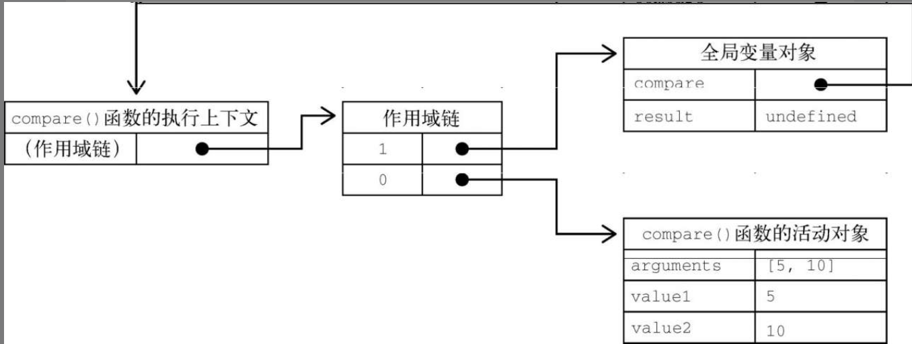
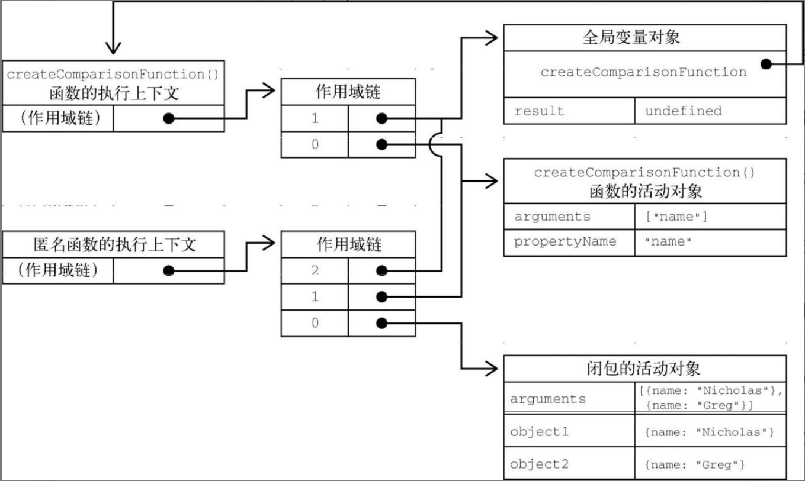

# 闭包
匿名函数经常被人误认为是闭包（closure）​。**闭包**指的是那些**引用了另一个函数作用域中变量的函数**，通常是在**嵌套函数**中实现的。

## 作用域链创建和使用
理解作用域链创建和使用的细节对理解闭包非常重要。
- 在**调用**一个**函数**时，会为这个函数调用创建一个**执行上下文**，并创建一个**作用域链**。
- 然后用**arguments**和**其他命名参数**来**初始化**这个函数的**活动对象**。
- **外部函数**的**活动对象**是**内部函数 作用域链上** 的**第二个对象**。
- 这个**作用域链**一直向外**串起了所有包含函数的活动对象**，直到**全局执行上下文才终止**。

``` javascript
function compare(value1, value2) {
    if (value1 < value2) {
        return -1;
    } else if (value1 > value2) {
        return 1;
    } else {
        return 0;
    }
}
let result = compare(5, 10);
```


- 函数执行时，每个**执行上下文**中都会有一个包含其中**变量的对象**。**全局上下文**中的叫**变量对象**，它会在**代码执行期间**始终存在。而函数**局部上下文**中的叫活动对象，只在**函数执行期间**存在。
- 在**定义**compare()函数时，就会为它**创建作用域链**，**预装载**全局变量对象，并保存在内部的[​[Scope]​]中。
- 在**调用**这个函数时，会**创建**相应的**执行上下文**，然后通过**复制**函数的[​[Scope]​]来**创建其作用域链**。
- 接着会**创建**函数的**活动对象**（用作变量对象）并将其**推入作用域链**的**前端**。

这意味着compare()函数执行上下文的作用域链中有两个变量对象：**局部变量对象**和**全局变量对象**。**作用域链**其实是一个**包含指针的列表**，每个指针分别指向一个变量对象，但**物理上**并**不会包含相应的对象**。

函数**内部**的代码在**访问变量**时，就会使用给定的名称从**作用域链中查找**变量。函数**执行完毕**后，**局部活动对象**会被**销毁**，内存中就**只剩**下**全局作用域**。不过，闭包就不一样了。

## 闭包
在一个函数**内部定义的函数**会把其**包含函数的活动对象**添**加**到自己的**作用域链**中。



``` javascript
function createComparisonFunction(propertyName) {
    return function (object1, object2) {
        let value1 = object1[propertyName];
        let value2 = object2[propertyName];
        if (value1 < value2) {
            return -1;
        } else if (value1 > value2) {
            return 1;
        } else {
            return 0;
        }
    };
}
let compare = createComparisonFunction('name');
let result = compare({ name: 'Nicholas' }, { name: 'Matt' });
```
**匿名函数**就可以访问到createComparison-Function()可以**访问的所有变量**。另一个有意思的**副作用**就是，createComparisonFunction()的**活动对象**并**不能**在它**执行完毕后销毁**，因为**匿名函数的作用域链中仍然有对它的引用**。在create-ComparisonFunction()执行完毕后，其**执行上下文的作用域链会销毁**，但它的活动对象仍然会保留在内存中，**直到匿名函数被销毁后才会被销毁**。

``` javascript
// 创建比较函数
let compareNames = createComparisonFunction('name');
// 调用函数
let result = compareNames({ name: 'Nicholas' }, { name: 'Matt' });
// 解除对函数的引用，这样就可以释放内存了
compareNames = null;
```
把compareNames设置为等于**null**会**解除对函数的引用**，从而让**垃圾回收程序**可以将**内存释放**掉。**作用域链**也会被销毁，**其他作用域（除全局作用域之外）**也可以**销毁**。

### 注意
因为**闭包**会保留它们包含函数的作用域，所以**比其他函数更占用内存**。**过度使用**闭包可能导致**内存过度占用**，因此建议仅在十分必要时使用。V8等优化的JavaScript引擎会努力回收被闭包困住的内存，不过我们还是建议在使用闭包时要**谨慎**。

## this对象
在闭包中使用this会让代码变复杂。
- 如果内部函数**没有使用箭头函数**定义，则this对象会在运行时**绑定到执行函数的上下文**。
- 如果在**全局函数**中调用，则this在**非严格模式**下等于**window**，在**严格模式**下等于**undefined**。
- 如果作为**某个对象的方法**调用，则this等于**这个对象**。

匿名函数在这种情况下不会绑定到某个对象，这就意味着this会指向window，除非在严格模式下this是undefined。不过，由于闭包的写法所致，这个事实有时候没有那么容易看出来。

### 为什么匿名函数没有使用其包含作用域（getIdentityFunc()）的this对象呢？
``` javascript
window.identity = 'The Window';
let object = {
    identity: 'My Object',
    getIdentityFunc() {
        return function() {
            return this.identity;
        };
    }
};
console.log(object.getIdentityFunc()()); // 'The Window'
```
- 每个函数在被调用时都会自动创建两个特殊变量：this和arguments。
- 内部函数永远不可能直接访问外部函数的这两个变量。
- 但是，如果把this保存到闭包可以访问的另一个变量中，则是行得通的。
``` javascript
window.identity = 'The Window';
let object = {
    identity: 'My Object',
    getIdentityFunc() {
        let that = this; // 把this保存到闭包可以访问的另一个变量中
        return function() {
            return that.identity;
        };
    }
};
console.log(object.getIdentityFunc()()); // 'My Object'
// 包含函数中名称没有任何与that冲突的变量。即使在外部函数返回之后，that仍然指向object，所以调用object.getIdentityFunc()()就会返回"MyObject"。
```

### 注意
this和arguments都是不能直接在内部函数中访问的。如果**想访问包含作用域中的arguments对象**，则同样需要**将其引用先保存到闭包能访问的另一个变量中**。

### 语法不同，可能影响this的值
``` javascript
window.identity = 'The Window';
let object = {
    identity: 'My Object',
    getIdentity(){
        return this.identity;
    }
};
// 正常调用，会返回"MyObject"，因为this.identity就是object.identity
object.getIdentity(); // 'My Object'
// 虽然加了括号之后看起来是对一个函数的引用，但this值并没有变。这是因为按照规范，object.getIdentity和(object.getIdentity)是相等的。
(object.getIdentity)(); // 'My Object'
// 执行了一次赋值，然后再调用赋值后的结果。因为赋值表达式的值是函数本身，this值不再与任何对象绑定，所以返回的是"The Window"
(object.getIdentity = object.getIdentity)(); // 'The Window'
```

## 内存泄露
由于IE在IE9之前对**JScript对象**和**COM对象**使用了**不同的垃圾回收机制**（第4章讨论过）​，所以闭包在这些旧版本IE中可能会导致问题。在这些版本的IE中，**把HTML元素保存在某个闭包的作用域中，就相当于宣布该元素不能被销毁**。
``` javascript
function assignHandler() {
    let element = document.getElementById('someElement');
    element.onclick = () => console.log(element.id);
}
```
以上代码创建了一个**闭包**，即**element元素的事件处理程序**（事件处理程 序将在第13章讨论）​。而这个**处理程序**又**创建**了一个**循环引用**。匿名函数引用着assignHandler()的活动对象，阻止了对element的引用计数归零。只要这个匿名函数存在，element的引用计数就至少等于1。也就是说，**内存不会被回收**。

稍加修改，就可以避免这种情况:
``` javascript
function assignHandler() {
    let element = document.getElementById('someElement');
    let id = element.id;
    element.onclick = () => console.log(id);
    element = null;
}
```
在这个修改后的版本中，闭包改为**引用一个保存着element.id的变量id**，从而**消除了循环引用**。不过，光有这一步还不足以解决内存问题。因为闭包还是会引用包含函数的活动对象，而其中包含element。即使**闭包没有直接引用element，包含函数的活动对象上还是保存着对它的引用**。因此，**必须再把element设置为null**。这样就解除了对这个COM对象的引用，其引用计数也会减少，从而确保其内存可以**在适当的时候被回收**。
