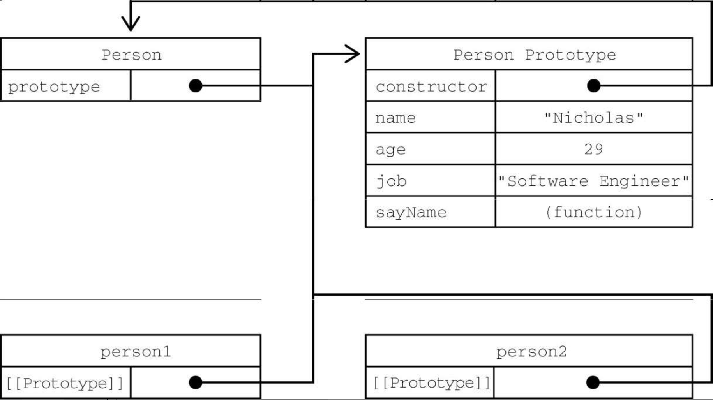

# 创建对象篇（续）
## 1. 原型模式
**每个函数**都会创建**一个prototype属性**，这个属性是**一个对象**，包含应该**由特定引用类型的实例共享的属性和方法**。实际上，**这个对象就是通过调用构造函数创建的对象的原型**。

🌟使用**原型对象**的**好处**是，**在它上面定义的属性和方法可以被对象实例共享**。

- 原来在构造函数中直接赋给对象实例的值，可以**直接赋值给它们的原型**，如下所示：
``` javascript
function Person() {}
Person.prototype.name = "Nicholas";
Person.prototype.age = 29;
Person.prototype.job = "Software Engineer";
Person.prototype.sayName = function() {
    console.log(this.name);
};
let person1 = new Person();
person1.sayName(); // "Nicholas"
let person2 = new Person();
person2.sayName(); // "Nicholas"
console.log(person1.sayName == person2.sayName); // true
```
- 使用**函数表达式**也可以：
``` javascript
let Person = function() {};
Person.prototype.name = "Nicholas";
Person.prototype.age = 29;
Person.prototype.job = "Software Engineer";
Person.prototype.sayName = function() {
    console.log(this.name);
};
let person1 = new Person();
person1.sayName();    // "Nicholas"
let person2 = new Person();
person2.sayName();    // "Nicholas"
console.log(person1.sayName == person2.sayName); // true
```
这里，**所有属性**和sayName()方法都**直接添加到了Person的prototype属性上**，**构造函数体中什么也没有**。但这样定义之后，**调用构造函数创建的新对象仍然拥有相应的属性和方法**。与构造函数模式不同，**使用这种原型模式定义的属性和方法是由所有实例共享的**。因此person1和person2访问的都是相同的属性和相同的sayName()函数。要理解这个过程，就必须理解ECMAScript中原型的本质。

### 理解原型
只要**创建一个函数**，就会按照特定的规则为这个函数**创建一个prototype属性**（指向原型对象）​。默认情况下，所有原型对象**自动获得一个名为constructor的属性**，**指回与之关联的构造函数**。对前面的例子而言，Person.prototype.constructor指向Person。然后，因构造函数而异，可能会给原型对象添加其他属性和方法。

在**自定义构造函数**时，原型对象**默认只会获得constructor属性**，**其他的所有方法都继承自Object**。每次调用构造函数创建一个新实例，这个实例的内部[​[Prototype]​]指针就会被赋值为构造函数的原型对象。脚本中没有访问这个[​[Prototype]​]特性的标准方式，但Firefox、Safari和Chrome会在每个对象上暴露__proto__属性，通过这个属性可以访问对象的原型。在其他实现中，这个特性完全被隐藏了。关键在于理解这一点：实例与构造函数原型之间有直接的联系，但实例与构造函数之间没有。
``` javascript
/＊＊
＊ 构造函数可以是函数表达式
＊ 也可以是函数声明，因此以下两种形式都可以：
＊    function Person() {}
＊    let Person = function() {}
＊/
function Person() {}
/＊＊
＊ 声明之后，构造函数就有了一个
＊ 与之关联的原型对象：
＊/
console.log(typeof Person.prototype);
console.log(Person.prototype);
// {
//    constructor: f Person(),
//    __proto__: Object
// }
/＊＊
＊ 如前所述，构造函数有一个prototype属性
＊ 引用其原型对象，而这个原型对象也有一个
＊ constructor属性，引用这个构造函数
＊ 换句话说，两者循环引用：
＊/
console.log(Person.prototype.constructor === Person); // true
/＊＊
＊ 正常的原型链都会终止于Object的原型对象
＊ Object原型的原型是null
＊/
console.log(Person.prototype.__proto__ === Object.prototype);    // true
console.log(Person.prototype.__proto__.constructor === Object); // true
console.log(Person.prototype.__proto__.__proto__ === null);      // true
console.log(Person.prototype.__proto__);
// {
//    constructor: f Object(),
//    toString: ...
//    hasOwnProperty: ...
//    isPrototypeOf: ...
//    ...
// }
let person1 = new Person(),
    person2 = new Person();
/＊＊
＊ 构造函数、原型对象和实例
＊ 是3 个完全不同的对象：
＊/
console.log(person1 ! == Person);              // true
console.log(person1 ! == Person.prototype); // true
console.log(Person.prototype ! == Person);   // true
/＊＊
＊ 实例通过__proto__链接到原型对象，
＊ 它实际上指向隐藏特性[[Prototype]]
＊
＊ 构造函数通过prototype属性链接到原型对象
＊
＊ 实例与构造函数没有直接联系，与原型对象有直接联系
＊/
console.log(person1.__proto__ === Person.prototype);    // true
conosle.log(person1.__proto__.constructor === Person); // true
/＊＊
＊ 同一个构造函数创建的两个实例
＊ 共享同一个原型对象：
＊/
console.log(person1.__proto__ === person2.__proto__); // true
/＊＊
＊ instanceof检查实例的原型链中
＊ 是否包含指定构造函数的原型：
＊/
console.log(person1 instanceof Person);              // true
console.log(person1 instanceof Object);              // true
console.log(Person.prototype instanceof Object);   // true
```


展示了Person构造函数、Person的原型对象和Person现有两个实例之间的关系。注意，Person.prototype指向原型对象，而Person.prototype.contructor指回Person构造函数。原型对象包含constructor属性和其他后来添加的属性。Person的两个实例person1和person2都只有一个内部属性指回Person.prototype，而且两者都与构造函数没有直接联系。另外要注意，虽然这两个实例都没有属性和方法，但person1.sayName()可以正常调用。这是由于对象属性查找机制的原因。

#### ``isPrototypeOf()``
✍虽然不是所有实现都对外暴露了[​[Prototype]​]​，但可以使用isPrototypeOf()方法确定两个对象之间的这种关系。本质上，``isPrototypeOf()``会在传入参数的[​[Prototype]​]指向调用它的对象时返回true
``` javascript
// 通过原型对象调用isPrototypeOf()方法检查了person1和person2。因为这两个例子内部都有链接指向Person.prototype，所以结果都返回true
console.log(Person.prototype.isPrototypeOf(person1));   // true
console.log(Person.prototype.isPrototypeOf(person2));   // true
```
#### ``Object.getPrototypeOf()``
返回参数的内部特性[​[Prototype]​]的值
``` javascript
// 第一行代码简单确认了Object.getPrototypeOf()返回的对象就是传入对象的原型对象。
// 第二行代码则取得了原型对象上name属性的值，即"Nicholas"。
console.log(Object.getPrototypeOf(person1) == Person.prototype);   // true
console.log(Object.getPrototypeOf(person1).name);                     // "Nicholas"
```
#### ``Object.setPrototypeOf()``
可以向实例的私有特性[​[Prototype]​]写入一个新值。这样就可以重写一个对象的原型继承关系。
``` javascript
let biped = {
    numLegs: 2
};
let person = {
    name: 'Matt'
};
Object.setPrototypeOf(person, biped);
console.log(person.name);                                      // Matt
console.log(person.numLegs);                                  // 2
console.log(Object.getPrototypeOf(person) === biped);   // true
```
⚡ Object.setPrototypeOf()可能**会严重影响代码性能**。Mozilla文档说得很清楚：​“在所有浏览器和JavaScript引擎中，修改继承关系的影响都是微妙且深远的。这种影响并不仅是执行Object.setPrototypeOf()语句那么简单，而是会涉及所有访问了那些修改过[​[Prototype]​]的对象的代码。​”
#### ``Object.create()``
为避免使用Object.setPrototypeOf()可能造成的性能下降，可以通过Object.create()来创建一个新对象，同时为其指定原型。
``` javascript
let biped = {
    numLegs: 2
};
let person = Object.create(biped);
person.name = 'Matt';
console.log(person.name);                                      // Matt
console.log(person.numLegs);                                  // 2
console.log(Object.getPrototypeOf(person) === biped);   // true
```

### 2. 原型层级
在通过对象访问属性时，会按照这个属性的名称开始搜索。
- ① 搜索开始于**对象实例本身**。
- ② 如果在这个实例上发现了给定的名称，则返回该名称对应的值。如果没有找到这个属性，则搜索会**沿着指针进入原型对象**，然后在原型对象上找到属性后，再返回对应的值。

⚡ 前面提到的constructor属性只存在于原型对象，因此通过实例对象也是可以访问到的。

#### 不能通过实例 重写 这些值
虽然**可以通过实例 读取 原型对象上的值**，但**不可能通过实例 重写 这些值**。如果在实例上添加了一个与原型对象中**同名**的属性，那就会在实例上创建这个属性，这个属性会**遮住**原型对象上的属性。
``` javascript
function Person() {}
Person.prototype.name = "Nicholas";
Person.prototype.age = 29;
Person.prototype.job = "Software Engineer";
Person.prototype.sayName = function() {
    console.log(this.name);
};
let person1 = new Person();
let person2 = new Person();
person1.name = "Greg";
// 因为这个属性在person1实例上存在，所以就不会再搜索原型对象了。而在访问person2.name时，并没有在实例上找到这个属性，所以会继续搜索原型对象并使用定义在原型上的属性。
console.log(person1.name);   // "Greg"，来自实例
console.log(person2.name);   // "Nicholas"，来自原型
```
#### 添加同名属性会切断改属性与原型的联系
只要给对象实例添加一个属性，这个属性就会遮蔽（shadow）原型对象上的同名属性，也就是虽然不会修改它，但会屏蔽对它的访问。即使在实例上把这个属性**设置为null，也不会恢复它和原型的联系**。不过，使用**delete操作符**可以**完全删除实例上的这个属性**，从而让标识符解析过程能够**继续搜索原型对象**。

``` javascript
function Person() {}
Person.prototype.name = "Nicholas";
Person.prototype.age = 29;
Person.prototype.job = "Software Engineer";
Person.prototype.sayName = function() {
    console.log(this.name);
};
let person1 = new Person();
let person2 = new Person();
person1.name = "Greg";
console.log(person1.name);   // "Greg"，来自实例
console.log(person2.name);   // "Nicholas"，来自原型
delete person1.name;
// 使用delete删除了person1.name，这个属性之前以"Greg"遮蔽了原型上的同名属性。然后原型上name属性的联系就恢复了，因此再访问person1.name时，就会返回原型对象上这个属性的值。
console.log(person1.name);  //"Nicholas"，来自原型
```
#### hasOwnProperty()
hasOwnProperty()方法用于确定某个属性是在实例上还是在原型对象上。这个方法是继承自Object的，会在属性存在于调用它的对象实例上时返回true
``` javascript
function Person() {}
Person.prototype.name = "Nicholas";
Person.prototype.age = 29;
Person.prototype.job = "Software Engineer";
Person.prototype.sayName = function() {
    console.log(this.name);
};
let person1 = new Person();
let person2 = new Person();
console.log(person1.hasOwnProperty("name")); // false
person1.name = "Greg";
console.log(person1.name); // "Greg"，来自实例
console.log(person1.hasOwnProperty("name")); // true
console.log(person2.name); // "Nicholas"，来自原型
console.log(person2.hasOwnProperty("name")); // false
delete person1.name;
console.log(person1.name); // "Nicholas"，来自原型
console.log(person1.hasOwnProperty("name")); // false
```
⚡ ECMAScript的Object.getOwnPropertyDescriptor()方法只对实例属性有效。要取得原型属性的描述符，就必须直接在原型对象上调用Object.getOwnProperty-Descriptor()。

### 原型与in操作符
有两种方式使用in操作符：
- 单独使用
- 在for-in循环中使用。

#### 单独使用
在单独使用时，in操作符会在可以通过对象访问指定属性时返回true，**无论该属性是在实例上还是在原型上**。
``` javascript
function Person() {}
Person.prototype.name = "Nicholas";
Person.prototype.age = 29;
Person.prototype.job = "Software Engineer";
Person.prototype.sayName = function() {
    console.log(this.name);
};
let person1 = new Person();
let person2 = new Person();
// 
console.log(person1.hasOwnProperty("name")); // false
console.log("name" in person1); // true

person1.name = "Greg";
console.log(person1.name); // "Greg"，来自实例
console.log(person1.hasOwnProperty("name")); // true
console.log("name" in person1); // true

console.log(person2.name); // "Nicholas"，来自原型
console.log(person2.hasOwnProperty("name")); // false
console.log("name" in person2); // true

delete person1.name;
console.log(person1.name); // "Nicholas"，来自原型
console.log(person1.hasOwnProperty("name")); // false
console.log("name" in person1); // true
```
**in操作符返回true且hasOwnProperty()返回false，就说明该属性是一个原型属性。**

#### 在for-in循环中使用
可以**通过对象访问**且**可以被枚举的属性**都会返回，包括**实例属性**和**原型属性**。遮蔽原型中不可枚举（​[​[Enumerable]​]特性被设置为false）属性的实例属性也会在for-in循环中返回，因为默认情况下开发者定义的属性都是可枚举的。

⚡要获得对象上**所有可枚举的实例属性**，可以使用``Object.keys()``方法。这个方法接收一个对象作为参数，返回包含该对象所有可枚举属性名称的字符串数组。
``` javascript
function Person() {}
Person.prototype.name = "Nicholas";
Person.prototype.age = 29;
Person.prototype.job = "Software Engineer";
Person.prototype.sayName = function() {
    console.log(this.name);
};

let keys = Object.keys(Person.prototype);
console.log(keys);    // "name,age,job,sayName"

let p1 = new Person();
p1.name = "Rob";
p1.age = 31;
let p1keys = Object.keys(p1);
console.log(p1keys); // "[name,age]"

// keys变量保存的数组中包含"name"、"age"、"job"和"sayName"。这是正常情况下通过for-in返回的顺序。而在Person的实例上调用时，Object.keys()返回的数组中只包含"name"和"age"两个属性
```

#### ``Object.getOwnPropertyNames()``
如果想列出所有实例属性，无论是否可以枚举，都可以使用``Object.getOwnPropertyNames()``
``` javascript
let keys = Object.getOwnPropertyNames(Person.prototype);
console.log(keys);    // "[constructor,name,age,job,sayName]"
// 返回的结果中包含了一个不可枚举的属性constructor
```
⚡Object.keys()和Object. getOwnPropertyNames()在适当的时候都可用来代替for-in循环。

### 属性枚举顺序
<!-- TODO -->


## 3. 对象迭代{Object.values()和Object.entries()}
ECMAScript 2017新增了两个静态方法，用于**将对象内容转换为序列化**的——更重要的是**可迭代**的——格式。这两个静态方法Object.values()和Object.entries()接收一个对象，返回它们内容的数组。
- Object.values()返回对象值的数组；
- Object.entries()返回键/值对的数组。

### 🌟注意
1. 非字符串属性会被转换为字符串输出。另外，这两个方法执行对象的**浅复制**：
``` javascript
const o = {
    qux: {}
};
console.log(Object.values(o)[0] === o.qux);
// true
console.log(Object.entries(o)[0][1] === o.qux);
// true
```
2. **符号属性会被忽略**：
``` javascript
const sym = Symbol();
const o = {
    [sym]: 'foo'
};
console.log(Object.values(o)); // []
console.log(Object.entries((o))); // []
```

### 其他原型语法
在前面的例子中，每次定义一个属性或方法都会把Person.prototype重写一遍。可以使用对象字面量重写原型，减少冗余精简
``` javascript
function Person() {}
Person.prototype = {
    name: "Nicholas",
    age: 29,
    job: "Software Engineer",
    sayName() {
        console.log(this.name);
    }
};
```
<!-- TODO -->

#### 问题
这样重写之后（使用对象字面量写原型），**Person.prototype的constructor属性就不指向Person了**。在创建函数时，也会创建它的prototype对象，同时会自动给这个原型的constructor属性赋值。而上面的写法**完全重写了默认的prototype对象**，因此其**constructor属性也指向了完全不同的新对象（Object构造函数）​，不再指向原来的构造函数**。
- **instanceof操作符还能可靠地返回值**，
- 但**不能再依靠constructor属性来识别类型**了
如下面的例子所示：
``` javascript
let friend = new Person();
console.log(friend instanceof Object);        // true
console.log(friend instanceof Person);        // true
console.log(friend.constructor == Person);   // false
console.log(friend.constructor == Object);   // true
```
### 原型的动态性
<!-- TODO -->

### 原生对象原型
<!-- TODO -->

### 原型的问题
原型模式也不是没有问题。
- 首先，它弱化了向构造函数传递初始化参数的能力，会导致所有实例默认都取得相同的属性值。
- 最主要问题源自它的共享特性。
<!-- TODO -->
  
